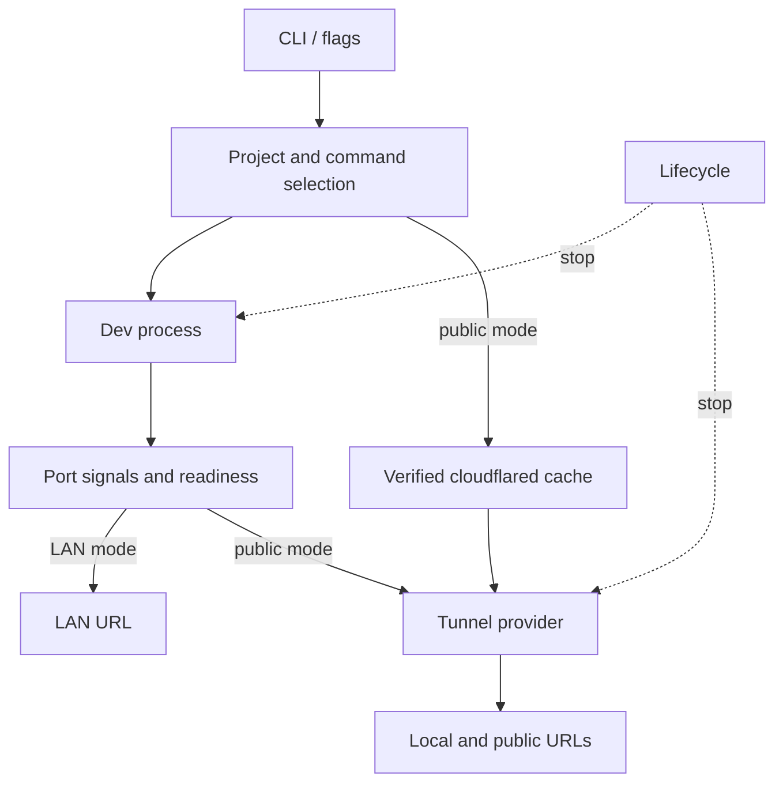
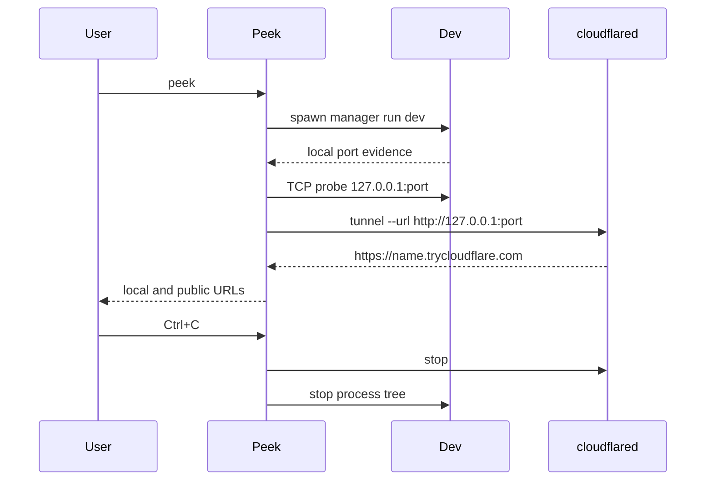

# Architecture

Peek is one Node.js CLI package. In public mode it owns two process trees: the
project's dev command and `cloudflared`. LAN mode owns only the dev process.
A single lifecycle object coordinates cancellation and cleanup. Optional
`peek.config.ts` is local project code; there is no Peek configuration service.



## Modules

| Module | Responsibility |
| --- | --- |
| `src/cli.ts` | Thin executable entry invoking the CLI command. |
| `src/cli-command.ts` | Citty flags, alias, top-level errors, and UI composition. |
| `src/core/project.ts` | Read local `package.json` and lockfiles only. |
| `src/core/framework.ts` | Identify a framework hint from local package metadata. |
| `src/core/config.ts` | Load and validate optional TypeScript project config. |
| `src/core/doctor.ts` | Run local environment checks without starting a preview. |
| `src/core/lan.ts` | Select and verify a local-network address. |
| `src/core/preview-checks.ts` | Probe public host rejection and eligible HMR upgrades. |
| `src/core/dev-command.ts` | Build safe executable/argument arrays. |
| `src/core/process.ts` | Spawn and observe the dev process with Execa. |
| `src/core/port.ts` | Parse local output signals and probe loopback TCP. |
| `src/core/server.ts` | Reconcile output, child listeners, and newly opened common ports. |
| `src/core/run.ts` | Order startup, hold a LAN preview, and reconnect a dropped tunnel. |
| `src/core/lifecycle.ts` | Checked phases, shutdown outcome, resource ownership, and signals. |
| `src/core/cleanup.ts` | Bounded provider and dev cleanup with forced termination and error results. |
| `src/cloudflared/*` | Fixed release mapping, download, checksum, and cache. |
| `src/tunnel/types.ts` | Local target, session/liveness and provider cleanup contract. |
| `src/tunnel/prepare.ts` | Prepare the verified managed Cloudflare provider; CLI composition consumes this factory. |
| `src/tunnel/cloudflare.ts` | Validate the loopback HTTP origin, start the transport, parse its public URL and confirm process shutdown. |
| `src/ui/*` | Human and JSON event output and terminal-size-aware QR rendering. |
| `src/ui/json-event.ts` | Type the current JSON payloads and own metadata/framing for runtime, help and version events. |
| `src/update/*` | Best-effort npm version check, user-level 24-hour cache, and notification timing; no dependency from the preview core. |
| `src/utils/errors.ts` | Actionable error categories and formatting. |

## Execution lifecycle

1. Parse flags, inspect the current project, and select an argv array. An
   explicit command after `--` bypasses project inspection.
2. In public mode, the tunnel preparation factory verifies or downloads the
   pinned `cloudflared` binary before starting the dev server. Register the
   prepared provider for cleanup. LAN mode skips the tunnel engine.
3. Snapshot common ports and an explicit `--port`, then spawn the dev command
   without a shell. Stream both output channels to the terminal and port
   detector.
4. Select one candidate port. `--port` wins. Otherwise, emitted local URLs,
   process-owned listeners, and newly opened common ports provide evidence.
   TCP readiness is checked at `127.0.0.1`. Conflicts fail closed.
5. Public mode starts a Quick Tunnel to that exact loopback service. A dropped
   tunnel is retried with bounded backoff while the dev process stays alive.
   Host-rejection and eligible HMR checks run after a valid public URL appears.
   LAN mode verifies a private interface address and shows its local URL.
6. If the dev server exits or the user sends SIGINT/SIGTERM, stop the tunnel
   first and then the dev process tree. Force termination after a short grace
   period.

An eligible interactive preview starts the update checker after command
validation without awaiting it. A successful result is held until the first
preview URL is visible, then shown at most once. JSON, doctor, CI, and test
modes skip the check. The checker only requests the published npm version and
cannot change preview lifecycle or exit status.



### Progress and ownership

`Lifecycle` owns the checked phase, cancellation signal, shutdown outcome,
registered dev process and provider, signal handlers, and cleanup result.
`runPeek` owns discovery, connection attempts, monitoring, and retry timing;
it advances phases as those operations occur. CLI callbacks still use the
existing output states and JSON fields rather than the internal phase names.

| Phase | Meaning | Next progress phase |
| --- | --- | --- |
| `idle` | Command validation and provider preparation | `starting-server` |
| `starting-server` | Start the selected argv command | `discovering-server` |
| `discovering-server` | Reconcile port evidence and verify TCP readiness | `server-ready` |
| `server-ready` | The selected port passed verification | `tunnel-connecting`, or `ready` for LAN |
| `tunnel-connecting` | Attempt the initial tunnel connection | `ready` |
| `ready` | A public or LAN URL was reported | `reconnecting` on a public tunnel drop |
| `reconnecting` | Replace the tunnel against the same dev port | `ready` |
| `stopping` | Cancel pending work and clean up owned resources | `stopped` |
| `stopped` | The cleanup attempt finished and its result is available | None |

Any active phase can enter `stopping`. Invalid progress transitions throw;
cancellation checks after awaited work and callbacks prevent a late result
from publishing readiness or starting preview probes after shutdown. Initial
connection retries stay in `tunnel-connecting`; retries after a tunnel drop
stay in `reconnecting`. Retry delays remain 1, 2, 4, 8, 16, then 30 seconds,
capped at 30 seconds, with no finite retry limit or counter reset on success.

Shutdown outcome is separate from progress: `completed`, `requested`, or
`failed` with its primary error. The first SIGINT or SIGTERM status is retained
as 130 or 143 even if another signal follows. `stopped` records completion of
the cleanup attempt; its result must be checked to know whether termination
was confirmed.

Resource registration is awaited. A different resource cannot replace one
already owned; a resource registered during or after shutdown receives bounded
cleanup and the registration rejects. Cancellation checks also prevent
starting resources after a stop. Signal installation is idempotent, and
cleanup removes the owned SIGINT/SIGTERM handlers.

### Shutdown and diagnostics

Shutdown caches one resolving `Promise<CleanupResult>` before abort listeners
or cleanup hooks run. Direct stops, repeated calls, and synchronous re-entry
reuse that promise. Every stop aborts pending work. Cleanup errors are returned
as an optional actionable `PROCESS_CLEANUP_ERROR`, rather than an unobserved
promise rejection.

Cleanup runs provider first, then the dev process tree:

| Resource | Graceful waiting budget | Escalation | Forced waiting budget |
| --- | --- | --- | --- |
| Provider | 5 seconds for `disconnect()` | Invoke optional `forceDisconnect()` | 1 second for the same shutdown promise |
| Dev process tree | 3 seconds after SIGTERM | Send SIGKILL | 1 second for exit observation |

The provider budget contains Cloudflare's existing 3-second graceful and
1-second forced waits. A further termination request forces both resources
and wakes the graceful wait immediately. Cleanup continues to the dev tree
if provider shutdown rejects or stalls; timers and temporary listeners are
removed after their waits. The nominal total waiting budget is 10 seconds.
These budgets bound observation; they cannot make a broken provider or the
operating system confirm termination. Missing force support and unconfirmed
shutdown produce cleanup diagnostics.

The CLI uses its existing renderer for both the primary startup/dev error and
a distinct cleanup error, in that order. Cleanup alone is rendered once.
Default output contains the message and remedy; causes appear only with
`--verbose`. JSON errors remain event objects with parseable stdout, without
fallback stacks or human logs. See the [JSON event contract](JSON.md) for the
wire shape and stream behavior. Ordinary failures and cleanup failure after
otherwise successful completion use exit 1. Signals retain 130/143; successful
completion and the live doctor's requested stop remain 0. CLI misuse remains 2.

### Provider and session boundary

```text
CLI composition
    -> tunnel preparation factory
    -> Lifecycle / runPeek
    -> TunnelProvider.connect({ target: URL, signal })
    -> TunnelSession { url: string, exited: Promise<TunnelExit> }
```

The CLI selects options and output. `src/tunnel/prepare.ts` owns concrete
Cloudflare construction and the verified binary dependency. Core orchestration
passes the selected, verified `http://127.0.0.1:<port>/` target; local display
URLs retain their existing localhost form. Cloudflare accepts root HTTP targets
on that numeric loopback address with a valid port and without credentials,
query or fragment. It rejects other origins before launching a process.

A `TunnelSession` reports the transport's public URL and termination. The
provider retains `disconnect()` and optional `forceDisconnect()` because
cleanup must also work when startup has not returned a session. `Lifecycle`
registers the provider before dev startup; `runPeek` disconnects before every
connect attempt. Reconnection preserves the dev process and verified target.
The session does not own the dev server or decide retry timing.

Cloudflare output parsing, process flags and config diagnostics stay inside the
tunnel implementation. Host-header compatibility remains the explicit
localhost override. Authentication, expiry and inspection are absent from
the transport contract. Doctor may inspect the managed engine as a diagnostic.

The future local proxy will enter after `server-ready` and before tunnel
connection. Its verified loopback listener becomes the provider target while
the dev URL remains the application target. Proxy readiness, ownership and
shutdown order must be integrated into the lifecycle when implemented. The
CLI and provider transport need no proxy authentication knowledge. Peek
currently has no local proxy.
