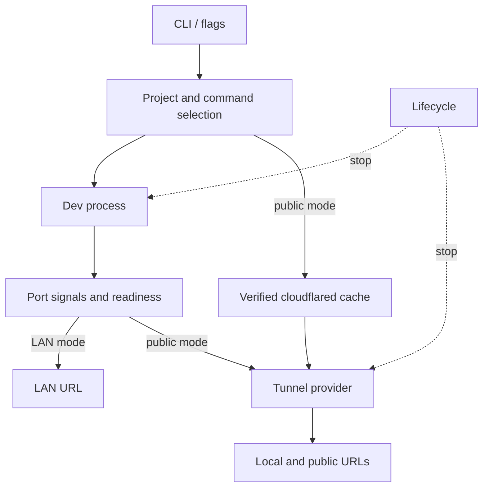
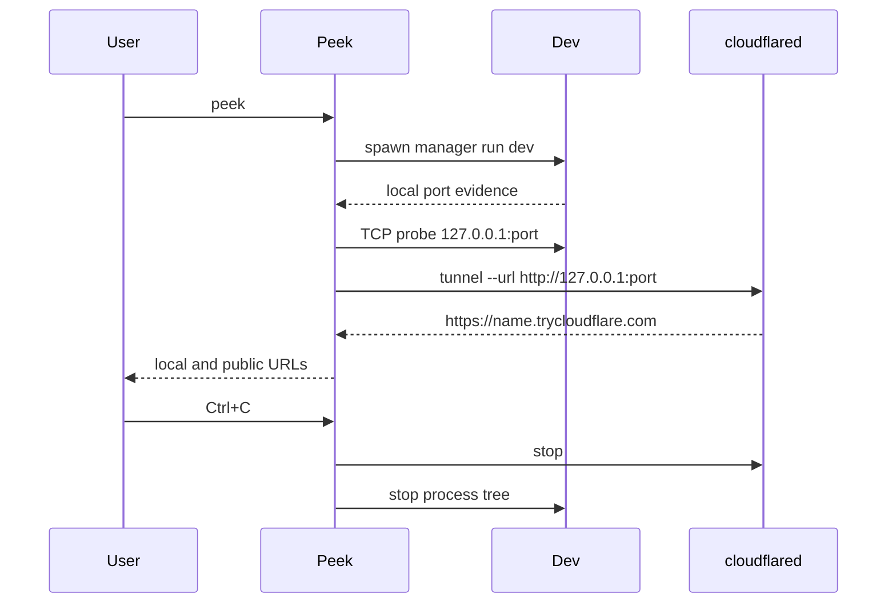

# Architecture

Peek is one Node.js CLI package. In public mode it owns two process trees: the
project's dev command and `cloudflared`. LAN mode owns only the dev process.
A single lifecycle object coordinates cancellation and cleanup. Optional
`peek.config.ts` is local project code; there is no Peek configuration service.

## Modules

| Module | Responsibility |
| --- | --- |
| `src/cli.ts` | Citty flags, alias, top-level errors, and UI wiring. |
| `src/core/project.ts` | Read local `package.json` and lockfiles only. |
| `src/core/framework.ts` | Identify a framework hint from local package metadata. |
| `src/core/config.ts` | Load and validate optional TypeScript project config. |
| `src/core/doctor.ts` | Run local environment checks without starting a preview. |
| `src/core/lan.ts` | Select and verify a local-network address. |
| `src/core/preview-checks.ts` | Probe public host rejection and eligible HMR upgrades. |
| `src/core/dev-command.ts` | Build safe executable/argument arrays. |
| `src/core/process.ts` | Spawn and observe the dev process with Execa. |
| `src/core/port.ts` | Parse local output signals and probe loopback TCP. |
| `src/core/server.ts` | Reconcile output, child listeners, and newly opened common ports. |
| `src/core/run.ts` | Order startup, hold a LAN preview, and reconnect a dropped tunnel. |
| `src/core/lifecycle.ts` | Signal handling, cancellation, and process-tree cleanup. |
| `src/cloudflared/*` | Fixed release mapping, download, checksum, and cache. |
| `src/tunnel/*` | Small provider contract and Cloudflare implementation. |
| `src/ui/*` | Human and JSON event output and terminal-size-aware QR rendering. |
| `src/utils/errors.ts` | Actionable error categories and formatting. |

## Execution lifecycle

1. Parse flags, inspect the current project, and select an argv array. An
   explicit command after `--` bypasses project inspection.
2. In public mode, verify or download the pinned `cloudflared` binary before
   starting the dev server. LAN mode skips the tunnel engine.
3. Snapshot common ports and an explicit `--port`, then spawn the dev command
   without a shell. Stream both output channels to the terminal and port
   detector.
4. Select one candidate port. `--port` wins. Otherwise, emitted local URLs,
   process-owned listeners, and newly opened common ports provide evidence.
   TCP readiness is checked at `127.0.0.1`. Conflicts fail closed.
5. Public mode starts a Quick Tunnel to that exact loopback service. A dropped
   tunnel is retried with bounded backoff while the dev process stays alive.
   Host-rejection and eligible HMR checks run after a valid public URL appears.
   LAN mode verifies a private interface address and shows its local URL.
6. If the dev server exits or the user sends SIGINT/SIGTERM, stop the tunnel
   first and then the dev process tree. Force termination after a short grace
   period.

The provider interface contains only `connect`, `disconnect`, and a connection
URL and exit promise. This keeps Cloudflare output parsing and process flags
out of server detection. Error objects carry a code, user message, and remedy;
the CLI prints causes only in verbose mode. The architecture is deliberately
small because Peek still has one provider and one server at a time.
